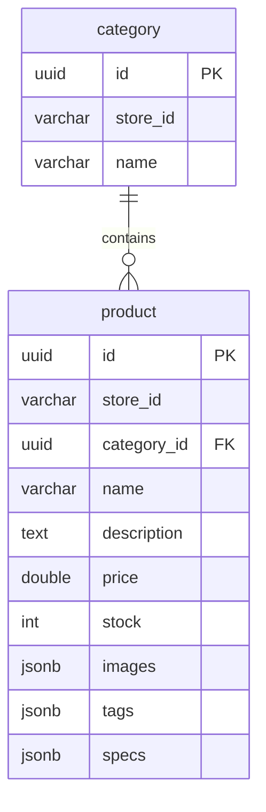

# catalog-service

Products, categories, inventory, and image URL attachment. Port **3004**, schema **`catalog_svc`**.

Platform design: [System design](https://github.com/digi-carts/doc/blob/main/architecture/system-design.md)

## Domain

Every product is scoped by `store_id` (required header `x-store-id` on most endpoints). Products have JSON arrays for images, tags, and specs. Stock can be deducted in bulk for checkout. Subscription product caps are enforced in `ProductService.create` (`403` on `IllegalStateException`).

Storefront Next.js rewrites `/uploads/:path*` to this service (`CATALOG_SERVICE_URL`) for media.

## Tech stack

Java 21, Spring Boot 3.3.0, Web, JPA (Hibernate JSON / jsonb), Liquibase, PostgreSQL. Optional `GCS_BUCKET` for object storage (platform TODO).

## Data model



Table names: `product`, `category` in `catalog_svc`.

## HTTP API

Gateway: `/api/catalog/**`, `/api/products/**`, `/api/categories/**`, `/api/upload/**`.

Native controllers use **unprefixed** `/products` and `/categories`.

### Products — `/products`

| Method | Path | Notes |
|--------|------|--------|
| GET | `/products` | Requires `x-store-id`. Query: `search`, `tag`, `category`, `sort`, `page` (default 1), `limit` (default 20) |
| GET | `/products/stock-summary` | `x-store-id` |
| GET | `/products/tags` | `x-store-id` |
| GET | `/products/{id}` | Wrapped `{ product }` |
| POST | `/products` | `ProductCreateRequest`; optional `x-user-email` |
| PATCH | `/products/{id}` | `ProductUpdateRequest` |
| DELETE | `/products/{id}` | Role via `x-user-role` |
| POST | `/products/deduct-stock` | `StockDeductRequest.items` |
| POST | `/products/{id}/images-url` | Body `{ "url": "..." }` |

### Categories — `/categories`

| Method | Path |
|--------|------|
| GET | `/categories` |
| POST | `/categories` |
| DELETE | `/categories/{id}` |

### Health

`GET /health`

## Configuration

| Variable | Required | Default |
|----------|----------|---------|
| `DATABASE_URL` | yes | schema `catalog_svc` |
| `PORT` | no | `3004` |
| `GCS_BUCKET` | prod images | — |

## Local run

```bash
export DATABASE_URL="jdbc:postgresql://localhost:5432/digicarts?currentSchema=catalog_svc"
mvn spring-boot:run
```

## CI/CD

`digi-cart-catalog-service-dev` / `digi-cart-catalog-service`.

## Related

- [order-service](https://github.com/digi-carts/order-service/blob/stage/doc/README.md) (stock deduct)
- [storefront](https://github.com/digi-carts/storefront/blob/stage/doc/README.md)
- [merchant-ui](https://github.com/digi-carts/merchant-ui/blob/stage/doc/README.md) catalog / stock

## REST API reference

See [api.md](api.md) for every HTTP endpoint generated from Spring controllers.
